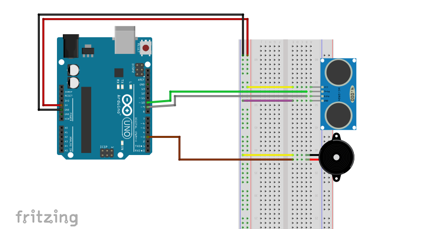

# Piippaava peruutuskamera
Tässä projektissa tehdään ultraäänisensorin avulla peruutuskamera, joka piippaa sitä tiuhempaan tahtiin, mitä lähempänä esine on.

### Tarvikkeet
- Arduino UNO ja siihen USB-johto
- Ultraäänisensori
- kaiutin
- hyppylankoja
- kytkentälevy

### Ultraäänisensorin kytkentä
Ultraäänisensorissa on neljä pinniä: GND, VCC, Echo ja Trig. Echo ja Trig kytketään joihinkin Arduinon digitaalisista pinneistä, joidenka edessä on ~-merkki. VCC kytketään käyttöjännitteeseen, eli Arduinossa pinniin 5V ja GND maadoitetaan, eli kytketään Arduinossa pinniin GND.

### Kaiuttimen kytkentä
Kaiuttimessa on plus- ja miinuspinni. Pluspinni kytketään Arduinossa johonkin ~-merkittyyn digitaaliseen pinniin ja miinuspinni maadoitetaan. 




### Ohjelmointi
```c++
const int trigPin = 10;
const int echoPin = 9;
const int Buzzer = 3;

long duration;
int distance;
```
Alussa määritämme projektissa tarvittavat pinnit (trigPin, echoPin sekä Buzzer) ja muuttujat (duration sekä distance).


```c++
void setup() {
  pinMode (trigPin, OUTPUT);
  pinMode (echoPin, INPUT);

  pinMode (buzzer, OUTPUT);
  
  Serial.begin(9600);
}
```
Setup-funktiossa määritämme pinnit joko outputeiksi tai inputeiksi, aloitamme myös serialin.


```c++
void loop() {  
  digitalWrite(trigPin, LOW);
  delayMicroseconds(2);

  digitalWrite(trigPin, HIGH);
  delayMicroseconds(10);
  digitalWrite(trigPin, LOW);

  duration = pulseIn(echoPin, HIGH);

  distance = duration*0.034/2;
````
Tässä trigPin lähettää kymmeneksi mikrosekunniksi 40 000 Hz ultraääntä. Jos ääni törmää johonkin matkallansa, hejastuu se takaisin ja echoPin havaitsee sen pulseIn()-funktiolla. Muutujan duration arvoksi tulee siis aika joka kuluu kun ultraääni kulkee kohti esinettä ja heijastuu siitä takaisin. Esineen etäisyys mittarista saadaan kertomalla duration 0.034:llä ja jakamalla se kahdella.


```c++
if (distance>2){
    tone(buzzer, 500);
    delay(100);
    noTone(buzzer);
    delay(distance*10);
  }
else{
    tone(buzzer, 500);
    delay(100);
  }
  
}
```
Seuraavaksi ohjelmoidaan kaiutin. Käytämme kaiuttimen käynnistämiseen tone()-funktiota. Sille annetaan parametrinä kaiuttimen pinni ja taajuus, jolla kaiuttimen halutaan kuuluvan. Kaiuttimen saa sammtettua noTone()-funktiolla. Saamme kaiuttimen piippauksen nopeutumaan käyttämällä hyväksi delay()-funktiota sekä ultraäänisensorin avulla saatua distance-muuttujaa. Pippausten välissä on delay, jonka arvoksi annamme distance-muuttujan kerrottuna kymmenellä. Näin piippausten tahti nopeutuu esineen lähentyessä sensoria. Jos kahta senttimetriä lähempänä sensoria, ei piippausten välillä ole enää taukoa. 


