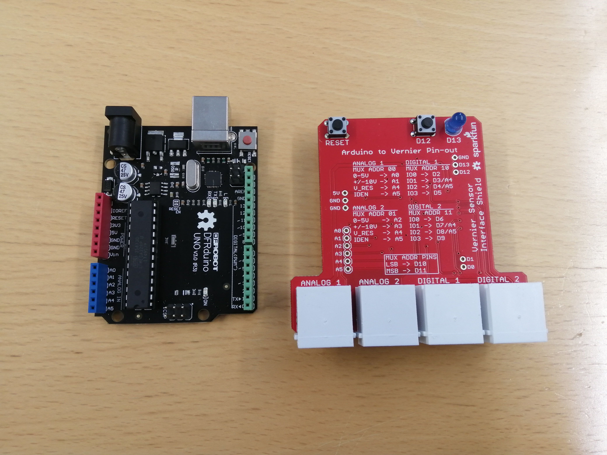
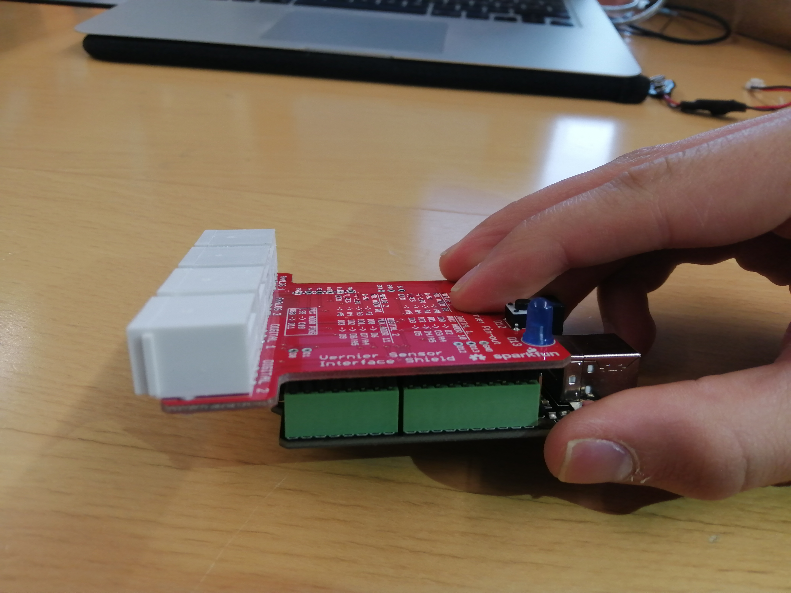

# Arduino Vernier-sensorit
Vernier-sensoretia voi käyttää arduinon kanssa. Ensin yhdistetää Arduinoon tarvittava rajapinta.
### Tarvikkeet
- Arduino ja siihen USB-liitäntä
- Vernier Sensoreiden rajapinta arduinoon
- Tarvittavia Vernier-sensoreita

&nbsp;

Vasemmalla Arduino, Oikealla Rajapinta
&nbsp;

&nbsp;

Arduino ja Rajapinta yhdistettynä. Laita Arduinon ja rajapinnan pinnit siten, että jokainen rajapinnan pinni on kunnolla kiinni Arduinossa.
&nbsp;

> Lataa tietokoneellesi Vernier-kirjasto. Se löytyy Arduino-sovelluksen Työkalut-valikosta kohdasta "hallitse kirjastoja". Kirjoita hakukentään "VernierLib" ja lataa kirjasto.

### Alkuun

