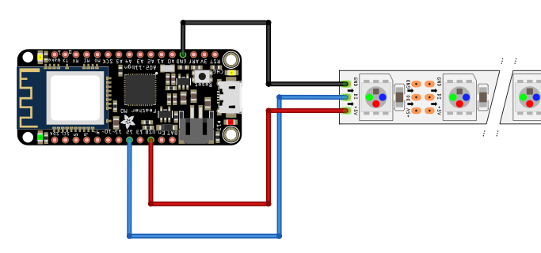

# Blynkin avulla toimiva Ledinauha
Tässä projektissa luomme yksinkertaisen IoT-laitteen käyttäen apuna Blynk-sovellusta. IoT:llä (Internet of Things) tarkoitetaan sitä, kun arkipäiväiset laitteet ja pienet esineet ovat yhteydessä toisiinsa Internetin välityksellä.

### Tarvikkeet
- Feather M0 ja siihen USB-johto
- Hyppylankoja
- Ledinauha
- Kännykkä, johon asennettu Blynk-sovellus
- Internet yhteys

### Ledinauhan kytkeminen
Ledinauhassa on kolme porttia. Portti joka on merkitty GND, tulee maadoittaa, eli kytkeä Featherin GND-porttiin. Ledinauhan keskimmäinen portti kytketään Featherin digitaaliseen porttiin 12 ja jäljelle jäänyt portti +5V kytketään käyttöjännitteeseen eli Featherin porttiin USB.



### Blynkin käyttöönotto
Avaa Blynk-sovellus. Luo käyttäjätunnus. Aloita uusi projekti ja nimeä se. Nimeämisen yhteydessä ohjelma kysyy, minkälaista laitetta ja yhteystyyppiä aiot käyttää. Valitse laitteeksi "Generic Board" ja yhteystyypiksi Wi-Fi. Luo projekti. Blynk lähettää sähköpostiisi (sähköpostiin, jonka ilmoitit rekisteröityessäsi) koodin, jota käytetään myöhemmin laitteen tunnistamisessa. 
Nyt projekti on luotu, mutta sillä ei ole vielä mitään toiminnallisuuksia Blynk-sovelluksessa. Haluamme lisätä ledinauhalle värin- ja kirkkaudensäätimen. Paina oikeassa yläkulmassa sijaitsevaa +-ikonia ja lisää sieltä projektiin "Vertical Slider" ja "zeRGBa". Paina "zeRGBa"-painiketta ja vaihda ylemmästä kytkimestä split mergeksi. Valitse PIN-nelikulmioon valikosta V1.  Palaa takaisin projektin yleisnäkymään. Valitse nyt "Vertical Slider". Valitse PIN-nelikulmioon valikosta V0. Luomme näin sovellukseen kaksi virtuaalista pinniä, joiden avulla muuttelemme ledinauhan väriä ja kirkkautta.


### Ohjelmointi
```c++
#include <Adafruit_NeoPixel.h>
#include <WiFi101.h>
#include <BlynkSimpleWifiShield101.h>
```
Projektissa käytämme kirjastoja, jotka täytyy sisällyttää ohjelman alussa. Jos kirjastoja, "Adafruit_NeoPixel.h." ja "WiFi101.h" ei ole vielä asennettu, voi sen tehdä "työkalut"-valikosta kohdasta "Ylläpidä kirjastoja...". Kirjoita hakukenttään halutun kirjaston nimi, ja asenna se. 


```c++
#define WIFI_SSID "KIRJOITA TÄHÄN NETIN NIMI"
#define WIFI_PASS "KIRJOITA TÄHÄN NETIN SALASANA"

char auth[] ="KIRJOITA TÄHÄN SÄHKÖPOSTIISI TULLUT PIN-KOODI";
```
Määritetään #define:n avulla vakiot "WIFI_SSID" ja "WIFI_PASS", joille annetaan arvoksi verkkosi nimi ja salasana. Kirjoita molemmat "-merkkien sisään, ja varmista että ne ovat kirjoitettu oikein. Char auth:lle annetaan arvoksi se koodi, jonka Blynk lähetti sähköpostiisi.
>Huomaa, että kännykkäsi ja tietokoneesi täytyy olla verkossa, jonka salasana ja nimen annoit ohjelmalle!


```c++
#define PIN 12    //Featherissä pinni johon ledinauha on kytketty
#define NUM_LEDS 30   //ledinaudan ledejen lukumäärä


Adafruit_NeoPixel strip = Adafruit_NeoPixel(NUM_LEDS, PIN, NEO_GRB + NEO_KHZ800);
```
Määritämme vakiot "PIN", jossa määritämme missä Featherin pinnissä ledinauha sijaitsee ja "NUM_LEDS", jolle määritämme kuinka monta lediä ledinauhassa on. Tämä saattaa vaihdella, joten laske oman ledinauhasi ledien määrä.


```c++
void setup() {
   WiFi.setPins(8, 7, 4, 2);
   Blynk.begin(auth, WIFI_SSID, WIFI_PASS);

   strip.begin();
   delay(500);

   for ( uint16_t i =0; i <strip.numPixels(); i++){
     strip.setPixelColor(i, 255,255,255);
    }

   strip.setBrightness(50);
   strip.show();

}
```
Setup-funktiossa sytytämme ledinauhan ja otamme yhteyden Blynk-palvelimeen.


```c++
BLYNK_WRITE(V0){ //kirkkauden säädin vidgetti kirjoittaa virtuaaliseen pinniin V0
  int brightness = param.asInt();
  strip.setBrightness(brightness);
  strip.show();
  }
```
Tässä määritämme mitä Blynk-sovellukseen luotu virtuaalinen pinni V0 tekee. Se säätelee lefinauhan kirkkautta.


```c++
BLYNK_WRITE(V1) //zeRGBa vidgetti kirjoittaa virtuaaliseen pinniin V1
{
  int red = param[0].asInt(); //values 0 or 1
  int green = param[1].asInt();
  int blue = param[2].asInt();

  for ( uint16_t i =0; i <strip.numPixels(); i++){
    strip.setPixelColor(i, red,green,blue);
    }
    strip.show();

}
```
Tässä määritämme mitä Blynk-sovellukseen luotu virtuaalinen pinni V1 tekee. Se säätelee ledinauhan väriä.


```c++
void loop() {
  // put your main code here, to run repeatedly:
  Blynk.run();

}
```
loop-funktiossa suoritamme Blynk-kirjastosta funktion run, joka suorittaa ohjelman. 
Aloita ohjelma lähettämällä se Featherille arduino sovelluksesta painamalla vasemmassa yläkulmassa olevaa nuolikuvaketta ja Blynkissä painamalla vasemmassa yläkulmassa olevaa kolmiota.


