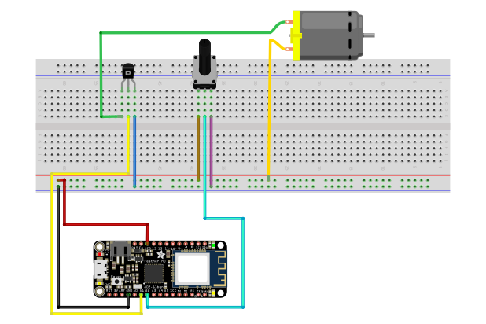

# Feather Transistori Moottori
Tässä projektissa tehdään tuuletin jota saa säädettyä potentiometrin avulla. Halutessaan projektiin voi myös lisätä puheohjaus toiminnon Rasperry Pi:n ja Google AIY voice kitin avulla. 

## Projektin feather osuus

### Tarvikkeet
- Transistori
- Hyppylankoja
- kytkentäalusta
- Feather M0 ja siihen USB-johto
- jonkin suuruinen vastus
- Potentiometri eli säätövastus
- Moottori ja siihen sopiva tuuletin

### Yleistä
Tarkista että tietokoneessasi kortti ja portti ovat asetettu oikein. Mene Arduino-sovelluksessa "työkalut" valikkoon ja valitse sieltä kortiksi "Adafruit Feather M0" ja portiksi "/dev/cu.usbmodem1420". 
Projektia tehdessä kannattaa kytkentäalustaan perustaa maadoitus- ja käyttöjänniterivit. Nämä rivit ovat yleensä pitkät poikittaiset rivit, jotka sijaitsevat kytkentäalustan reunoilla. Rivi joka on merkitty - merkillä maadoitetaan, eli kytketään Featherin GND porttiin. Rivi, joka on merkitty + merkillä kytketään käyttöjännitteeseen eli tässä tapauksessa Featherin USB porttiin. Näin jos jokin projektin komponentti täytyy maadoittaa tai kytkeä jännitteeseen, voi sen yhdistää jompaankumpaan näistä riveistä 

### Potentiometrin kytkentä
Potentiometrissä on kolme pinniä. Keskimmäinen pinni kytketään Featherin analogiseen porttiin A2. Toinen jäljellejääneistä porteista kytketään käyttöjännitteeseen ja toinen maadoitetaan.

### Transistorin kytkentä
Transistorilla on kolme pinniä. Niistä keskimmäinen kytketään Featherin analogiseen porttiin A1. Oikeanpuolimmainen pinni kytketään toiseen moottorin porteista. Vasemmanpuolimmainen maadoitetaan. 

### Moottorin kytkentä
Moottorin toinen portti kytketään transistorin oikeanpuolimmaiseen pinniin ja toinen käyttöjännitteeseen.




### Ohjelmointi
>Ohjelman löydät kokonaisuudessaan tämän README.md tiedoston kanssa samasta kansiosta nimellä FeatherTransistoriMoottoriVer1.ino

```c++ 
#define MOOTTORI A1
#define POTENTIOMETRI A2
````
Määritämme missä porteissa moottori ja potentiometri sijaitsevat, tässä tapauksessa featherin analogisissa porteissa A1 ja A2.


```c++
void setup(){
    Serial.begin(9600);
}
````
Setup-funktiossa avaamme sarjamonitorin, jotta voimme myöhemmin tarkastella, toimiiko potentiometri halutulla tavalla.

```c++
void loop(){
    int potentiometri = analogRead(POTENTIOMETRI)/4;
    Serial.println(potentiometri);
    delay(100);
            
    analogWrite(MOOTTORI, potentiometri);
}
````
Feather toistaa loop-funktiota ikuisesti. Alussa luomme uuden kokonaisluku muotoisen (int) muuttujan nimeltä potentiometri. Annamme sille arvoksi analogRead-funktion avulla POTENTIOMETRI pinnin antaman arvon. Määritimme ohjelman alussa sen olevan featherin analogisen portin A2 arvo. Tämä arvo tulee vielä jakaa neljällä, koska analogRead-funktio antaa arvoja välillä 0-1023, mutta analogWrite ottaa arvoja väliltä 0-255.
Lopuksi käytämme analogWrite-funktiota, joka antaa sille ensimmäisenä parametrinä annetulle analogiselle portille toisena parametrina annetun arvon.


