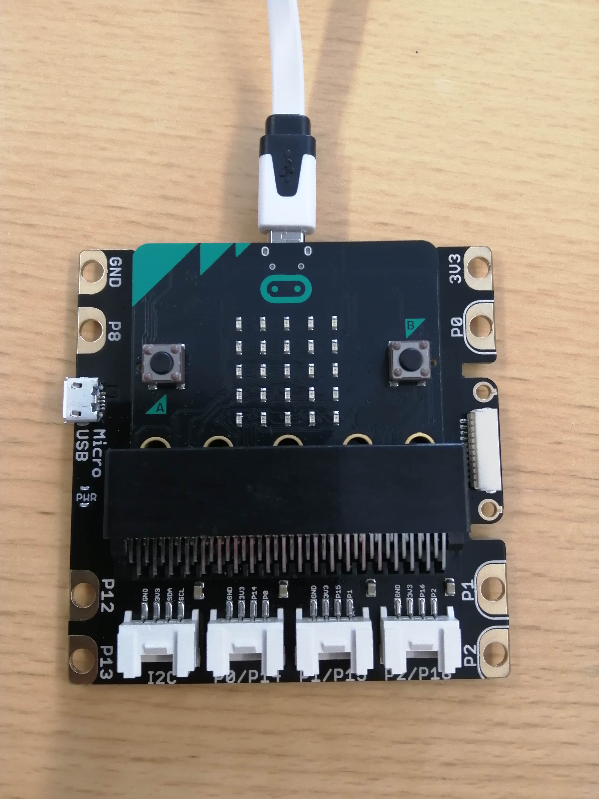
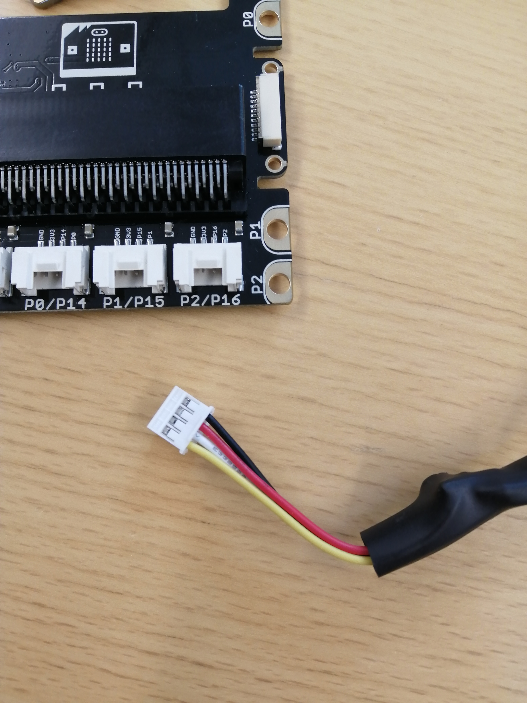
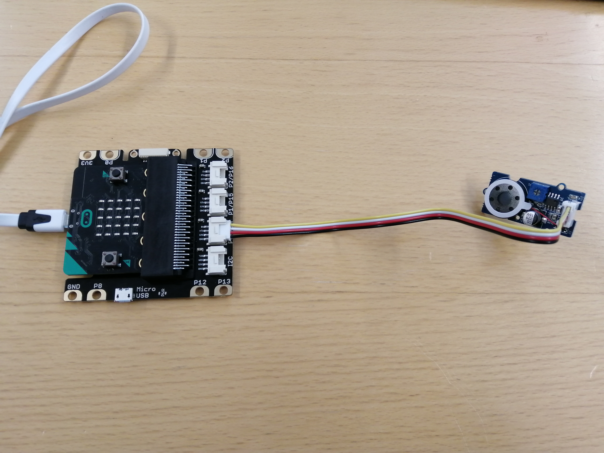

# Microbit Grove Shield
Tehdään Microbitille Grove Shieldin avulla erilaisia projekteja.
&nbsp;

&nbsp;

Grove shield yhdistettynä microbittiin.

&nbsp;

Grove Shiedin kanssa toimivat komponentit yhdistetään siihen erityisillä liittimillä.

## Käänneltävä kaiutin
Kaiutin, jonka soittaman nuotin taajuus on riippuvainen microbitin asennosta.
### Tarvikkeet
- Microbit ja siihen USB-johto
- Grove Shield Microbitille
- Grove shieldiin yhteensopiva kaiutin

### Kytkentä
Yhdistä kaiutin porttiin P0.

### Ohjelmointi
[Tästä löydät ohjelman koodilohkoina](https://makecode.microbit.org/_f3bX77hg0bkv)

Ohjelmassa luodaan ensin uusi muuttuja "taajuus", jonka arvoksi asetetaan microbitin liiketunnistimen antama arvo. Arvo on jotain väliltä -1023-1023. Asetetaan liikkeentunnistimen akseliksi x-akselin, koska kaiutinta säädellään kääntämällä microbittiä vasemmalta oikealle. Jos microbittiä käännetään vasemmalle, tulee "taajuus" muuttujan arvosta negatiivinen. Arvo ei kuitenkaan voi olla negatiivinen. Asetetaan ohjelmaan if-else-rakenne. Jos liikkeentunnistin antaa negatiivisen arvon, tulee "taajuus" muuttujan arvoksi liikkeentunnistimen antama arvo kerrottuna miinus yhdellä. Muutoin "taajuus" saa arvoksi liikkeentunnistimen antaman arvon. Annetaan kaiuttimelle soitettavaksi "taajuus".