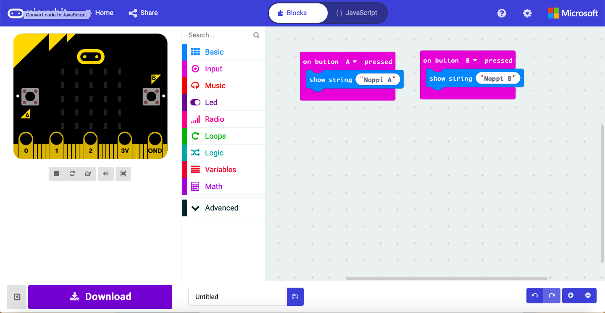
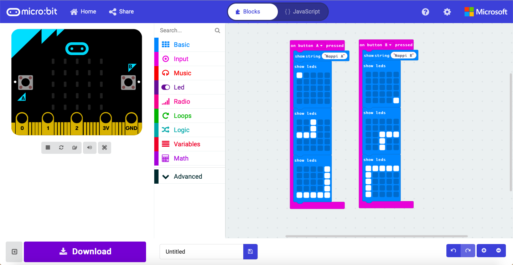
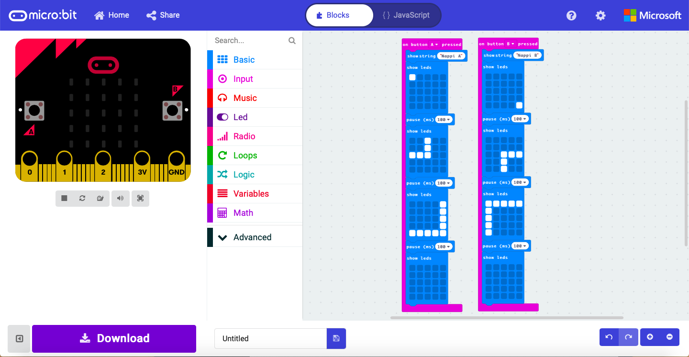

# Microbit napit koodilohkoilla
Tässä yksinkertaisessa projektissa harjoitellaan koodilohkojen ja Microbitin käyttämistä. Ohjelmoimme mikrobitin napit tekemään jotain.

## Microbit
Microbit on pieni tietokone, joka sisältää 24 punaista lediä, kaksi ohjelmoitavaa nappia, liikkeentunnisimen ja kompassin. Microbit voi myös olla bluetooth yhteydssä esim. tietokoneen kanssa ja voi ottaa yhteyden myös internettiin.

### Tarvikkeet
- Microbit ja siihen USB-johto

### Ohjelmointi
Mene seuraavalle sivulle:
[Linkki makecode:iin](https://makecode.microbit.org)
&nbsp;

Luo uusi projekti painamalla New Project. Ohjemassa on valmiina "on start" ja "forever"-toiminnot, poista ne.
&nbsp;

&nbsp;

Lisää ohjelmaan input-valikosta kaksi "on button _ pressed"-toiminnallisuutta ja aseta toiseen A ja toiseen B
&nbsp;

&nbsp;

Lisää ohjelmaan basic-valikosta kaksi "show string"-toiminnallisuutta ja asta ne molempien napinpainallusten sisään. Kirjoita tyhjiin kenttiin jotain, mitä haluat Microbitin sanovan kun nappeja painetaan. 
&nbsp;

&nbsp;

Seuraavaksi lisäämme molempiin napinpainalluksiin pienen animaation.

Lisää molempiin napinpainalluksiin kolme "show leds"-toiminnallisuutta basic-valikosta. Asettele ledit niihin kuvan tapaan.
&nbsp;

&nbsp;

Viimeisenä lisätään animaation askelten väleihin vielä pienet tauot, jotta niitä ehtii nähdä. Lisätään loppuun vielä tyhjä "show leds" että ledit sammuu lopuksi kokonaan.
&nbsp;

&nbsp;

>Voit kokeilla koodiasi painamalla vasemman yläkulman Microbitin A- tai B-nappia.

### Ohjelman siirtäminen Microbitille
Nimeä ohjelmasi alakulman tekstikenttään ja paina Download-nappia. Lataa tiedosto koneellesi ja siirrä se Microbit-levyasemalle.

