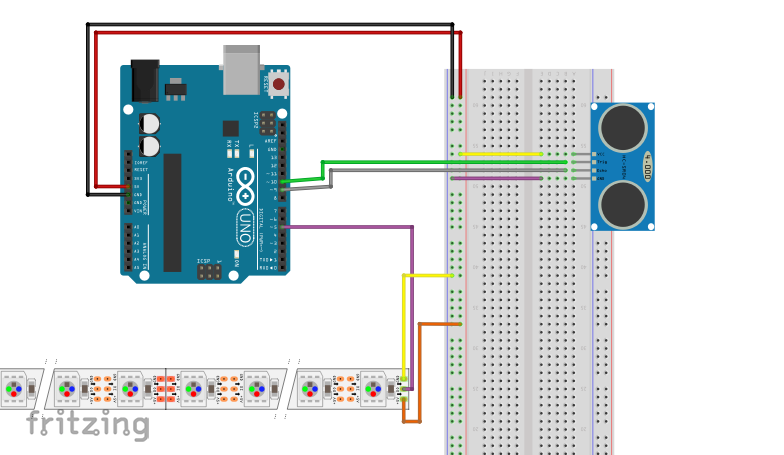

# Ultraäänisensorilla ohjailtava ledinauha
Tässä projektissa tehdään ledinauha, jota ohjataan käyttäen ultraäänisensoria.

### Tarvikkeet
- Ultraäänisensori
- Kytkentäalusta
- Ledinauha
- Hyppylankoja
- Arduino UNO ja siihen USB-johto

### Ultraäänisensorin kytkentä
Ultraäänisensorissa on neljä pinniä: GND, VCC, Echo ja Trig. Echo ja Trig kytketään joihinkin Arduinon digitaalisista pinneistä, joidenka edessä on ~-merkki. VCC kytketään käyttöjännitteeseen, eli Arduinossa pinniin 5V ja GND maadoitetaan, eli kytketään Arduinossa pinniin GND.

### Ledinauhan kytkentä
Ledinauhassa on kolme porttia. Portti joka on merkitty GND, tulee maadoittaa, eli kytkeä Arduinon GND-porttiin. Ledinauhan keskimmäinen portti kytketään Arduinon digitaaliseen porttiin 5 ja jäljelle jäänyt portti +5V kytketään käyttöjännitteeseen eli Arduinon porttiin 5V.



### Ohjelmointi

```c++
#include <Adafruit_NeoPixel.h>

#define PIN 5
#define NUM_LEDS 30

const int trigPin = 10;
const int echoPin = 9;
long duration;
int distance;
````
Alussa sisällytämme ohjemaamme "Adafruit_NeoPixel.h"-kirjaston jonka avulla käytämme ledinauhaa. Sen jälkeen määritämme kaikki ohjelmassa tarvittavat muuttujat.


```c++

Adafruit_NeoPixel strip = Adafruit_NeoPixel(NUM_LEDS, PIN, NEO_GRB + NEO_KHZ800);
uint32_t magenta = strip.Color(255, 0, 255);
uint32_t tyhja = strip.Color(0, 0, 0);
````
Luomma uuden olion luokkaan "Adafruit_NeoPixel". Määritämme kaksi väriä käyttäen uint32_t-muuttujatyyppiä. Tyhja on väritön.

>Voit itse päättää mitä väriä haluat käyttää magentan paikalla, aseta vain numeroiden tilalle jotkut toiset RGB-arvot. Esim: Punainen=(255, 0, 0), vihreä=(0, 255, 0) tai sininen=(0, 0, 255).

```c++
void setup(){
  Serial.begin(9600);
  strip.begin();
  delay(500);
  
  pinMode (trigPin, OUTPUT);
  pinMode (echoPin, INPUT);
  
}
```
Setup-funktiossa aloitamme Serialin ja ledinauhan. Sekä määritämme trig- ja echoPinnin inputiksi ja outputiksi. 


```c++
void loop(){
  digitalWrite(trigPin, LOW);
  delayMicroseconds(2);

  digitalWrite(trigPin, HIGH);
  delayMicroseconds(10);
  digitalWrite(trigPin, LOW);

  duration = pulseIn(echoPin, HIGH);

  distance = duration*0.034/2;
  Serial.println(distance);
  delay(75);
```
Tässä ohjelmoimme ultraäänisensorin. Jos haluat tietää siitä enemmän, katso PiippaavaPeruutuskamera-projektin ohjeistusta.


```c++

  strip.fill(magenta, 0, distance);
  strip.setBrightness(50);
  strip.show();

  strip.fill(tyhja, distance, 30-distance);
  strip.setBrightness(50);
  strip.show();

}
Fill()-funktiolla väritämme ledinauhaa. Funktiolle annetaan ensimmäisenä parametrina halutun värin, toisena ensimmäisen väritettävän ledin numeron ja kolmantena väritettävien ledejen lukumäärän. Ensin väritämme ledinauhan magentaksi siihen asti, missä kohtaa ultraäänisensori havaitsee esineen. Värittömäksi asetamme ne ledit, jotka ovat eivät ole havaitun esineen ja ultraäänisensorin välisellä alueella. 
    
    
