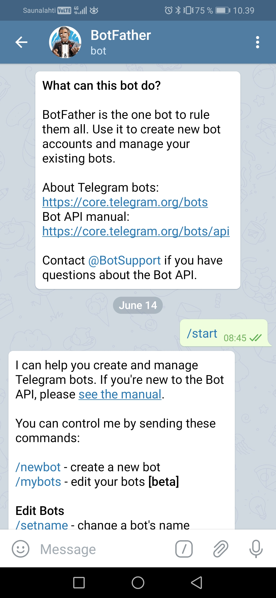
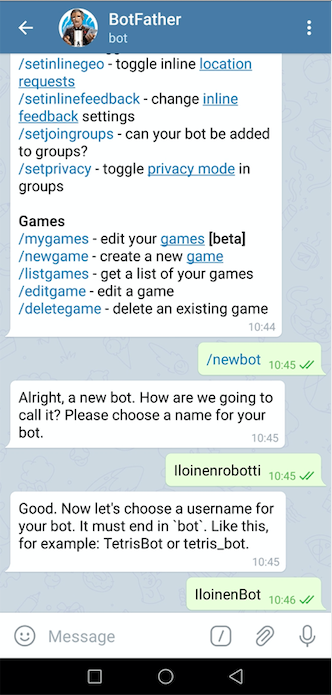
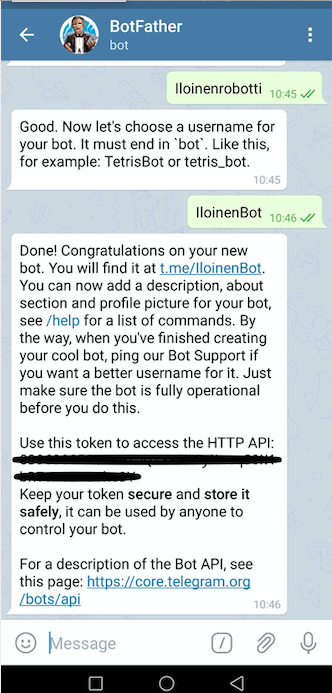

# Telegram botin luominen
Ohjeistus Telegram-viestittelusovelluksessa toimivan botin luontia varten.

## 1.
Aloita uusi keskustelu Botfatherin kanssa
&nbsp;

&nbsp;

## 2. 
Kirjoita BotFatherille "/start"
&nbsp;

&nbsp;

## 3. 
Anna BotFatherille komento "/newbot" ja anna sille nimi sekä käyttäjänimi.
&nbsp;

&nbsp;

## 4. 

Nyt botti on luotu. Saat Botfatherilta tokenin, jonka avulla bottia ohjelmoidaan.
&nbsp;

