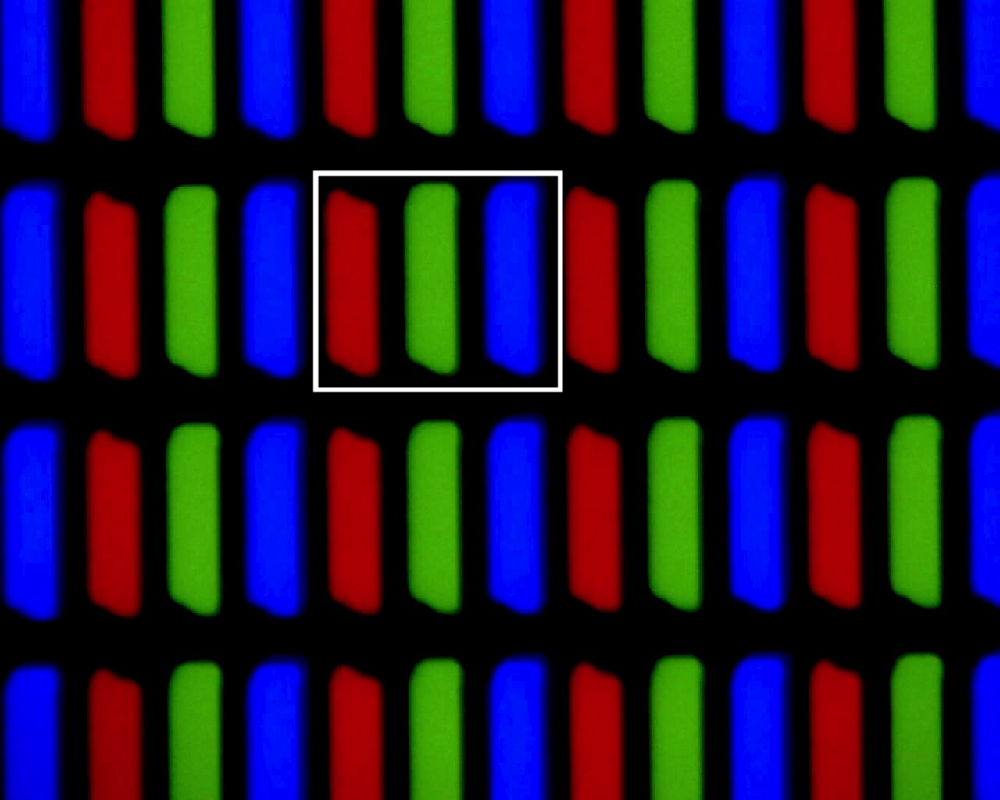
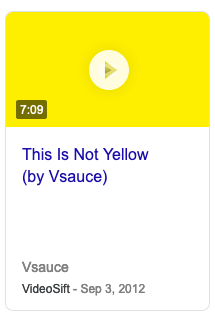
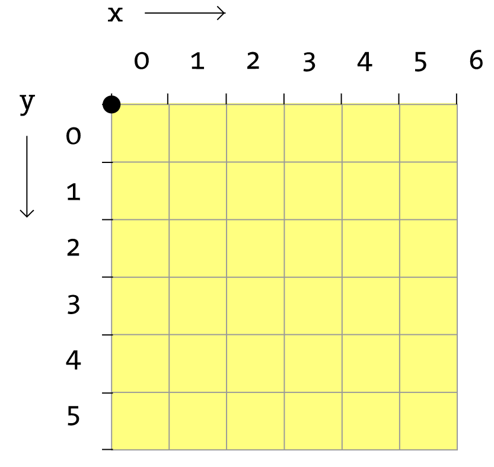

# Digitaalinen kuva
Nykyään suurin osa kuvista on digitaalisia. Ne siis tallennetaan ja käsitellään digitaalisesti.
Sähköiset kuvat ovat erilaisia kuin painetut tai teetetyt kuvat. Painokuvissa värit tuotetaan painamalle eri värisiä musteita päällekkäin valkoiselle paperille. Niin saadaan tuotettua eri sävyt.

Näytöillä kuvat tuotetaan pikseleillä eli pienillä lampuilla. Yleensä tietokoneen näytöt ovat RGB-näyttöjä, eli ne koostuvat punaisista (red), vihreistä (green) ja sinisistä (blue) alipikseleistä.

Kuvaan on merkitty yksi pikseli. Jokaisessa pikselissä on kolme eri väristä alipikseliä.

Kun näyttöä katsoo kauempaa, siitä ei erota pikseleitä, vaan se näyttää yhtenäiseltä. Kuvan näyttö näyttää valkoiselta, koska siinä kaikki alipikselit ovat päällä. Näyttöjen toiminta siis perustuu illuusioon.

Eri sävyjä tuotetaan säätämällä alipikselien kirkkautta suhteessa toisiinsa. Esimerkiksi sininen väri tuotetaan sammuttamalla punaiset ja vihreät alipikselit ja jättämällä siniset päälle. Kuitenkaan esimerkiksi keltaista ei voi tuottaa näin, koska RGB-näytöissä ei ole keltaisia alipikseleitä. Keltainen väri tuotetaan laittamalla punaiset ja vihreät alipikselit päälle ja siniset pois. Syntyvä valo näyttää keltaiselta, vaikka siinä ei olekaan keltaista valoa. Tässäkin hyödynnetään illuusiota.

## Processing ja pikselit

Processing käsittelee pikseleitä koordinaatistona. Koordinaatisto toimii kuin matematiikassa, eli jokaisesta pisteestä eli pikselisä ilmoitetaan x ja y. Pikseli (0, 0) on vasemmassa yläkulmassa, ja x-koordinaatit kasvavat oikealla, y-koordinaatit alaspäin.

