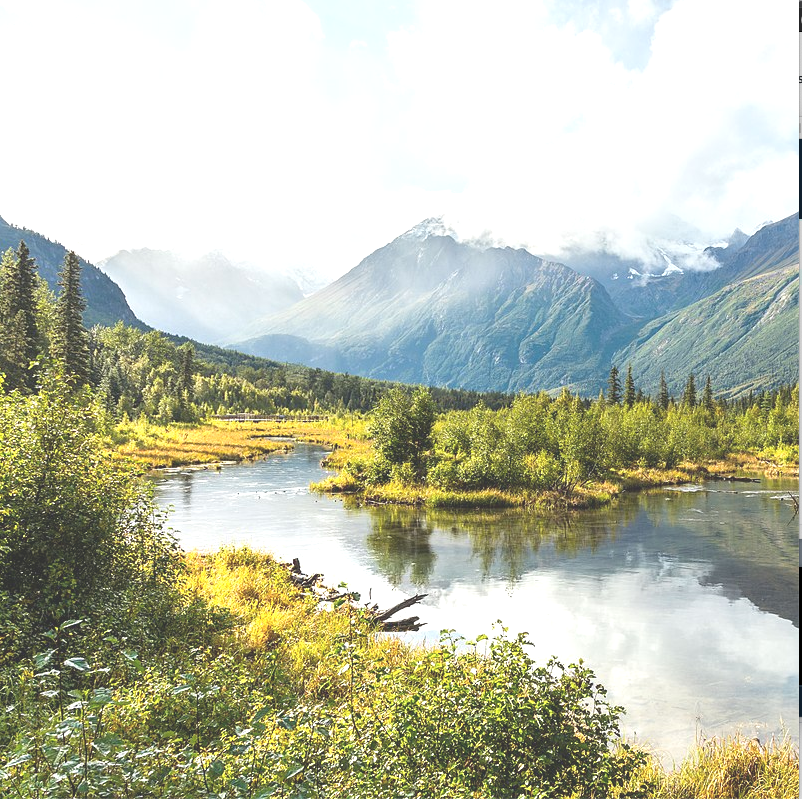
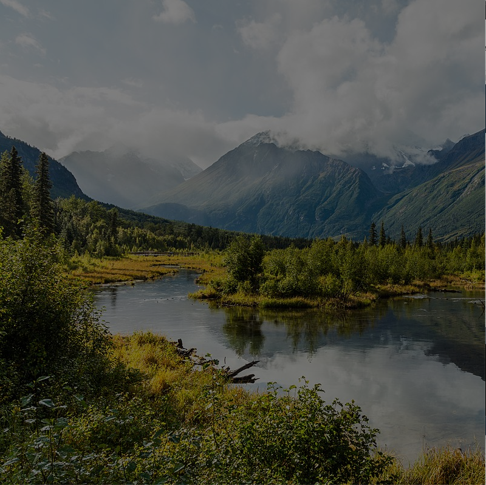
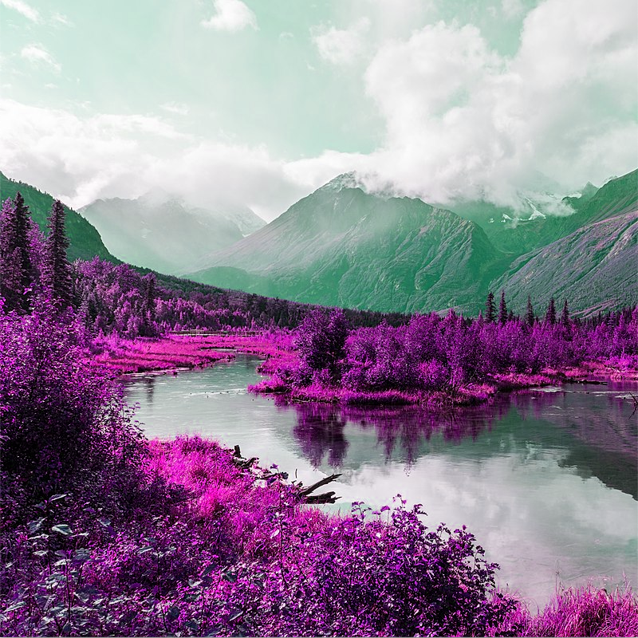
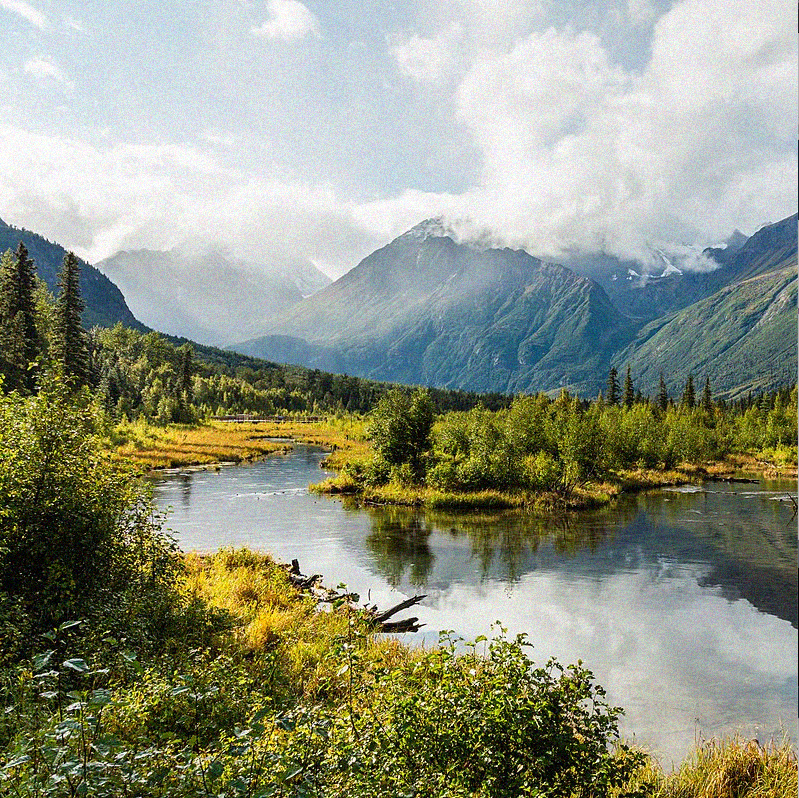

# Valmiin kuvan muokkaus

Processingissa voi avata olemassa olevan kuvan.
```processing

PImage img;
void setup() {
  size(800, 800);
  stroke(255);
  img = loadImage("https://upload.wikimedia.org/wikipedia/commons/thumb/8/81/Parque_Eagle_River%2C_Anchorage%2C_Alaska%2C_Estados_Unidos%2C_2017-09-01%2C_DD_02.jpg/1280px-Parque_Eagle_River%2C_Anchorage%2C_Alaska%2C_Estados_Unidos%2C_2017-09-01%2C_DD_02.jpg", "jpg");
  for(int x=0; x<1280;x++){
    for(int y=0; y<853;y++){
     color c = img.get(x,y);
     float r = red(c);
     float g = blue(c);
     float b = green(c)+10;
     img.set(x, y, color(r, g, b));
   }
 }
 image(img,0,0);
}

  

void draw() {

}

```

Tällä tavalla voi muokata yksittäisiä pikseleitä ja niiden komponentteja. Esimerkiksi punaista voi lisätä ja vihreää vähentää. Esimerkkejä:







Vaikka tällaisen muutoksen saa tehtyä helposti kuvanmuokkausohjelmassa, esimerkiksi Photoshopissa tai Lightroomissa, näin voi muokata erittäin tarkasti yksi pikseli kerrallaan, ja halutessaan lisätä muuta logiikkaa. Lisäksi tällä tavalla oppii, miten esimerkiksi kuvan lämpötila, kirkkaus tai kontrasti syntyy yksittäisistä pikseleistä.
